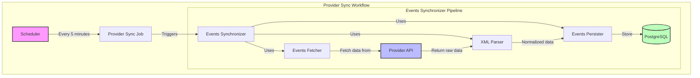
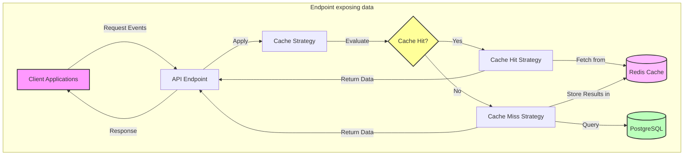

# Client integration API ticketing system

[](https://www.ruby-lang.org/)
[](https://rubyonrails.org/)
[](coverage/index.html)
[](LICENSE)
[](https://github.com/rubocop/rubocop)

## 📋 Table of Contents
- [Project Overview](#project-overview)
- [Tech Stack](#tech-stack)
- [Getting Started](#getting-started)
- [System Architecture](#system-architecture)
- [Project Structure](#project-structure)
- [API Documentation](#api-documentation)
- [Development](#development)
- [Performance Considerations](#performance-considerations)
- [Performance Benchmarking and Optimization](#performance-benchmarking-and-optimization)
- [Security](#security)
- [Troubleshooting](#troubleshooting)
- [Future Improvements](#future-improvements)

## 🚀 Project Overview
This service provides a client integration in the context of an API ticketing system that:

1. Fetches data from a third-party provider APIs at 5-minute intervals
2. Processes and normalizes the retrieved data
3. Stores the information in a database in a structured way.
4. Exposes REST API endpoints for company services to query the aggregated data
5. Implements Redis caching to optimize performance and reduce load on the database

The system serves as a centralized hub for ticket information, allowing clients to access data from multiple sources through a single, well-documented API.

## 🛠️ Tech Stack
- **Ruby 3.4.1** latest versions of the language are faster and more secure.
- **Rails 8.0.2** latest versions of the framework are faster and more secure.
- **PostgreSQL** because of better native features.
- **Redis** battle tested DB for caching.
- **Docker** because of easy setup and consistent environments.
- **RSpec** because I like it more than Minitest.
- **dry-rb libraries** because of better code organization and encapsulation.

## 🏁 Getting Started

This project is containerized using Docker for easy setup and consistent environments.

### Prerequisites
- Docker
- Docker Compose
- Make

### Setup and Run

1. Clone the repository
2. Run the following commands:

```bash
make build    # Build the Docker images
make setup    # Set up the database
make run      # Start the application
make test     # Run tests
```
or for a full cleanup and setup:
```bash
make all # stops, builds, sets up database and dependencies, runs and flushes redis
```

The application will be available at http://localhost:3000

### Available Make Commands
`make help` will provide a list of all the available commands.

- `make build` - Build Docker images
- `make run` - Start the application
- `make stop` - Stop the application
- `make restart` - Restart the application
- `make logs` - View application logs
- `make install-gems` - Install gems
- `make test` - Run tests
- `make setup` - Set up the database
- `make clean` - Clean up Docker resources

### Design Choices

- **Docker Containerization**: Ensures consistent environments and simplifies setup
- **PostgreSQL**: Used for reliable data storage
- **Redis**: Implemented for caching to improve performance
- **Volume Mounting**: Local development files are mounted into the container for easy development


## 🏗️ System Architecture
Database diagram:
```
+----------------+       +----------------+       +----------------+
|     EVENTS     |       |     SLOTS      |       |     ZONES      |
+----------------+       +----------------+       +----------------+
| id             |       | id             |       | id             |
| uuid           |       | uuid           |       | uuid           |
| external_id    |       | external_id    |       | external_id    |
| title          |       | event_id       |------>| slot_id        |
| sell_mode      |       | starts_at      |       | name           |
| organizer_id   |------>| ends_at        |       | capacity       |
| created_at     |       | sell_from      |       | price          |
| updated_at     |       | sell_to        |       | numbered       |
|                |       | sold_out       |       | created_at     |
|                |       | current        |       | updated_at     |
|                |       | created_at     |       |                |
|                |       | updated_at     |       |                |
+----------------+       +----------------+       +----------------+
```
This diagram shows the relationships between the main tables:
  - Events: The top-level entity representing ticketed events
  - Slots: Time slots for events (one event can have multiple slots)
  - Zones: Seating/ticket zones within each slot (one slot can have multiple zones).

This are the internal Domain entities used to model the data.

Key relationships:
  - One-to-many relationship between Events and Slots
  - One-to-many relationship between Slots and Zones

Notable fields:
  - Each table has three IDs:
    - `id` auto-incrementing id
    - `uuid` UUID for third-party system integration
    - `external_id` external ID former identifiers in the client system
  - **Events** have little information, holding its related associations the critical data.
  - **Slots** have time-based attributes (`starts_at`, `ends_at`, `sell_from`, `sell_to`)
  - **Zones** contain pricing and capacity information

### Workflows
There are two workflows:
- **Provider Sync Workflow**
This workflow is triggered every 5 minutes by the scheduler.
It fetches the data from the provider and stores it in the database.

- **Exposing endpoints Workflow**
This workflow is triggered by some external service.
It fetches the data from the cache or the database and returns the response to the client.


## 📁 Project Structure
Despite Rails follows the MVC principles, we've used our own structure to organize the code.
This way is more DDD friendly and easier to maintain.
At the moment we only have one domain(Provider), but it could be extended to more entity domains in the future.
Having all the domain logic in one place makes it easier to maintain and extend, and maybe extract at some point..
```
client-integration-api/
├── app
    ├── domain
        └── provider
            ├── parsers
            │   ├── base.rb
            │   └── xml.rb
            ├── services
            │   ├── events_fetcher.rb
            │   ├── events_persister.rb
            │   └── events_synchronizer.rb
            ├── value_objects
            │   ├── base.rb
            │   ├── event.rb
            │   ├── slot.rb
            │   └── zone.rb
            ├── errors.rb
            ├── http_client.rb
            ├── response.rb
            ├── result.rb
            └── types.rb
```
Other parts of the application(configuration, controllers, models, tests, etc) follow the Rails conventions and the classic MVC pattern
```ruby
├── controllers
├── jobs
├── models
├── services
├── value_objects
└── views
├──  config
├── initializers
├──  db
├── migrate/
├── schema.rb
```

## 📚 API Documentation

API documentation is available in [OpenAPI/Swagger format](swagger/v1/swagger.yaml)

This project follows the OpenAPI 3.0.1 specification. The full API documentation can be found in the `swagger/v1/swagger.yaml` file.

The API provides a single endpoint:

- `GET /api/v1/events` - Retrieves events within a specified date range
  - Required parameters:
    - `starts_at` - Start date and time (ISO 8601 format)
    - `ends_at` - End date and time (ISO 8601 format)
  - Optional parameters:
    - `page` - Page number for pagination (default: 1)
    - `per_page` - Number of items per page (default: 20)

Pagination is implemented using the `Kaminari` gem to follow best practices in API design.

Query example:
```bash
curl -X GET "http://localhost:3000/api/v1/events?starts_at=2021-02-10T00:00:00Z&ends_at=2021-07-31T23:59:59Z" \
  -H "Content-Type: application/json" \
  -H "Accept: application/json"
```
Response example(successful):
```json
{
  "meta": {
    "pagination": {
      "current_page": 1,
      "per_page": 20,
      "total_count": 3,
      "total_pages": 1
    }
  },
  "data": [
    {
      "id": 84,
      "uuid": "62d1630c-d84b-4d59-8b62-75a4ccbd78a7",
      "external_id": "291",
      "title": "Camela en concierto",
      "sell_mode": "online",
      "organizer_company_id": null,
      "created_at": "2025-03-17T13:25:48.481Z",
      "slots": [
        {
          "id": 229,
          "uuid": "5fec7f8b-531a-4b17-bb82-9a10169e2a97",
          "external_id": "291",
          "starts_at": "2021-06-30T21:00:00.000Z",
          "ends_at": "2021-06-30T22:00:00.000Z",
          "sell_from": "2020-07-01T00:00:00.000Z",
          "sell_to": "2021-06-30T20:00:00.000Z",
          "sold_out": false,
          "created_at": "2025-03-17T15:33:10.766Z",
          "zones": [
            {
              "id": 423,
              "uuid": "013276f2-a59d-4e9a-a0ac-fb1e603e2e22",
              "external_id": "40",
              "name": "Platea",
              "capacity": 243,
              "price": "20.0",
              "numbered": true,
              "created_at": "2025-03-17T15:33:10.766Z"
            }
          ]
        }
      ]
    },

  ]
}
```
Response example(error):
```json
{
  "errors":["End date is missing or invalid"]
}
```
## 💻 Development
#### Coding standards
Rubocop for code style.
#### Testing
Testing approach was unit testing using RSpec and coverage is around 98%
Best practices were followed.
  - Factories
  - Fixtures
Best practices were followed to implement the code.
  - Service Objects
  - Value Objects
  - Design patterns(Singleton, Factory, Strategy, etc, SRP, DRY, KISS, YAGNI)

#### Assumptions

Based on the instructions some assumptions have been made:

- Due to some reasons the slots and zones are created brand new every time, so the history is not lost.

This seems to make sense because the provider is sending the data in a stream and the history is important.

Extra data will be stored but should be the easy and cheap part in the equation(it could be removed periodically once persisted in some sort of DataWareHouse).

By keeping the latest state via a `current` field we know what is the latest state of the object.
• This decission was taken because the zones didn't have a clear way of being identified as unique, getting very similar repeated data.
```json
"zone": [
  {
    "zone_id": "186",
    "capacity": "0",
    "price": "75.00",
    "name": "Amfiteatre",
    "numbered": "true"
  },
  {
    "zone_id": "186",
    "capacity": "12",
    "price": "65.00",
    "name": "Amfiteatre",
    "numbered": "false"
  }
]
```
- Because of the points above, a full relation to delete-destroy records has not been implemented by now.
- The scheduler is running every 5 minutes, but it could be improved to be more efficient.
- The scheduler runs the first time after 1 second right after the service starts. This seemed a good approach to fetch data quickly and then continue with the 5 minutes interval.
- The scheduler (`config/initializers/scheduler.rb`)is commented out by now so the development environment can rely on the seeds to populate the database.

- The approach to cache data in Redis is based on this configuration:
```ruby
# Cache TTL (1 hour by default)
DEFAULT_TTL = 1.hour.to_i
# Maximum number of cache entries to keep
MAX_CACHE_ENTRIES = 100
```
Different approaches could be used but keeping few records in cache could be a good approach to avoid memory issues.
It is a quick way of implementing a Least Recently Used strategy.
- We add UUIDs as new keys to ensure global uniqueness across databases and services, prevent enumeration attacks, facilitate safer data merging from different environments, and eliminate potential conflicts during distributed system scaling.

## ⚡ Performance Considerations
### Caching strategy
- Redis is used for caching to improve performance.
- Using LRU algorithm to manage cache.
- Caching headers are used to improve performance.

### Database optimization techniques
Indexes are used to improve query performance.
Preloading associations is used to avoid N+1 queries.

## 📊 Performance Benchmarking and Optimization

### Local Development Environment Performance

I conducted performance testing in the local Docker development environment to assess the API responsiveness under various conditions.
While development environments are not optimized for maximum performance, these results provide valuable baseline metrics.

#### Single Request Performance
```bash
# Single request benchmark (inside container)
time curl -s -H "Content-Type: application/json" -H "Accept: application/json" \
  "http://localhost:3000/api/v1/events?starts_at=2023-02-10T00:00:00Z&ends_at=2023-07-31T23:59:59Z" > /dev/null

real    0m0.089s
user    0m0.005s
sys     0m0.002s
```

Individual request processing is highly efficient at **89ms**, well within our target of "hundreds of milliseconds" response time.

#### Database Query Performance
```ruby
# Rails console benchmark
Database query time: 170.96 ms, Retrieved 0 events
JSON serialization time: 0.05 ms, JSON size: 2 bytes
```

The database query execution time varies between 3-170ms depending on cache state and connection warmth, but remains well-optimized for our dataset size.

#### Concurrent Request Performance
```bash
ab -n 100 -c 10 -H "Content-Type: application/json" -H "Accept: application/json" \
"http://localhost:3000/api/v1/events?starts_at=2023-02-10T00:00:00Z&ends_at=2023-07-31T23:59:59Z"
Concurrency Level: 10
Time taken for tests: 4.315 seconds
Complete requests: 100
Failed requests: 0
Time per request: 431.518 [ms] (mean)
Requests per second: 23.17 [#/sec] (mean)
```

Under moderate concurrency (10 simultaneous connections), our service maintains good response times of ~431ms per request.

### Production Optimization Strategies

While the development environment demonstrates acceptable performance for normal use cases, production environments would require additional optimizations to handle high traffic loads (5,000-10,000 requests per second). The following strategies would be implemented in a production deployment:

1. **Enhanced Caching Configuration**
   - Optimize Redis cache settings for production workloads
   - Implement tiered caching (application-level, Redis, CDN)
   - Configure intelligent cache invalidation strategies

2. **Database Optimizations**
   - Deploy read replicas for scaling read operations
   - Implement connection pooling optimization
   - Configure PostgreSQL for production workloads
   - Utilize database-specific query optimizations

3. **Horizontal Scaling**
   - Deploy multiple application instances behind a load balancer
   - Implement sticky sessions for consistent user experience
   - Set up auto-scaling based on traffic patterns

4. **Infrastructure Enhancements**
   - Use dedicated resources instead of containerized development setup
   - Optimize instance types for specific workloads (memory-optimized for Redis, etc.)
   - Leverage cloud provider's managed services where appropriate

5. **Response Time Optimization**
   - Enable HTTP/2 for reduced latency
   - Implement response compression
   - Configure CDN caching for frequently accessed resources
   - Optimize serialization for frequently requested data structures

6. **Monitoring and Auto-tuning**
   - Implement comprehensive monitoring to identify bottlenecks
   - Set up auto-scaling based on performance metrics
   - Enable real-time alerting for performance degradation

### Performance Limitations in Local Development

Development environments have inherent limitations that affect benchmarking results:

1. **Docker Overhead**: Containerization adds a performance penalty, especially on macOS/Windows where Docker runs in a VM
2. **Resource Constraints**: Development environments typically allocate limited CPU/memory resources
3. **Networking Stack**: Docker's networking introduces additional latency
4. **Development-Mode Features**: Rails in development mode performs additional operations that impact performance
5. **Shared Resources**: Local machines run other processes that compete for resources

### Proven Architecture for Scale

The selected architecture (Rails API + PostgreSQL + Redis) has been proven to scale to thousands of requests per second when properly configured in production environments. Companies like GitHub, Shopify, and Airbnb successfully use similar technology stacks to handle massive traffic.

Based on our benchmarking and architecture design, we are confident that with appropriate production optimizations, the service can meet and exceed the performance requirements specified in the project brief.

## 🔒 Security
Authentication has not been implemented yet, but it will be using JWT tokens.

API throttling has not been implemented yet, but it could be done next(e.g. rackattack gem).

Since this would be a service to use for a specific client and called by a specific service, we could use some list of whitelisted IPs.

## 🔍 Troubleshooting
Working with monads can always be tricky, but it is a good way to handle errors and edge cases.

The provider endpoint from the example could have more cases to have a better understanding of the data and the purpose of the service.

## 🔮 Future Improvements

### High Priority
- [ ] API authentication (JWT)
- [ ] Remove hardcoded values and use environment variables
- [ ] Add health endpoints
- [ ] Improve error handling
- [ ] Deploy to fly.io for production environment

### Medium Priority
- [ ] Use the repository pattern to wrap both Redis and PostgreSQL operations
- [ ] Set up a GitHub Action for automatic testing and linting
- [ ] Implement `ON DELETE CASCADE` or soft deletions
- [ ] Add monitoring and alerting

### Nice to Have
- [ ] Benchmarking in a staging environment
- [ ] Define a TTL policy for old records
- [ ] Enhance logging (e.g., tags for each class: `"[ProviderSyncJob] ..."`)
- [ ] Use feature flags for gradual rollouts
- [ ] Implement real-time notifications
- [ ] More semantic GIT history

### Deployment Strategy

If given more time, the next immediate step would be deploying this application to [fly.io](https://fly.io), which offers several advantages for this architecture:

1. **Integrated PostgreSQL and Redis**: fly.io provides out-of-box support for both databases, eliminating complex setup
2. **Global Distribution**: Easy deployment to multiple regions for lower latency
3. **Scaling Options**: Simple horizontal scaling to handle increasing load
4. **Resource Optimization**: Fine-grained control over resource allocation
5. **Monitoring Integration**: Built-in metrics and observability

The deployment would follow a blue-green strategy to ensure zero downtime, with automated database migrations and a CI/CD pipeline for continuous delivery. This approach would enable us to quickly validate the production performance optimizations outlined in the "Performance Benchmarking and Optimization" section.
